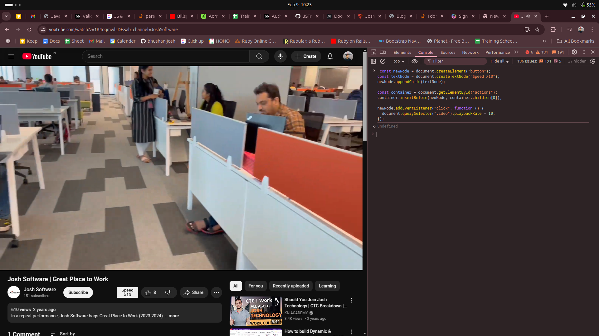

```javascript
const newNode = document.createElement("button");
const textNode = document.createTextNode("Speed X10");
newNode.appendChild(textNode);

const container = document.getElementById("actions");
container.insertBefore(newNode, container.children[0]);

newNode.addEventListener("click", function () {
  document.querySelector("video").playbackRate = 10;
});
```

### Tried example:
